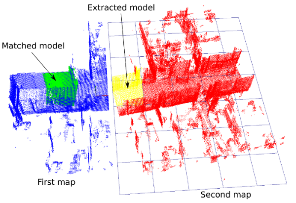
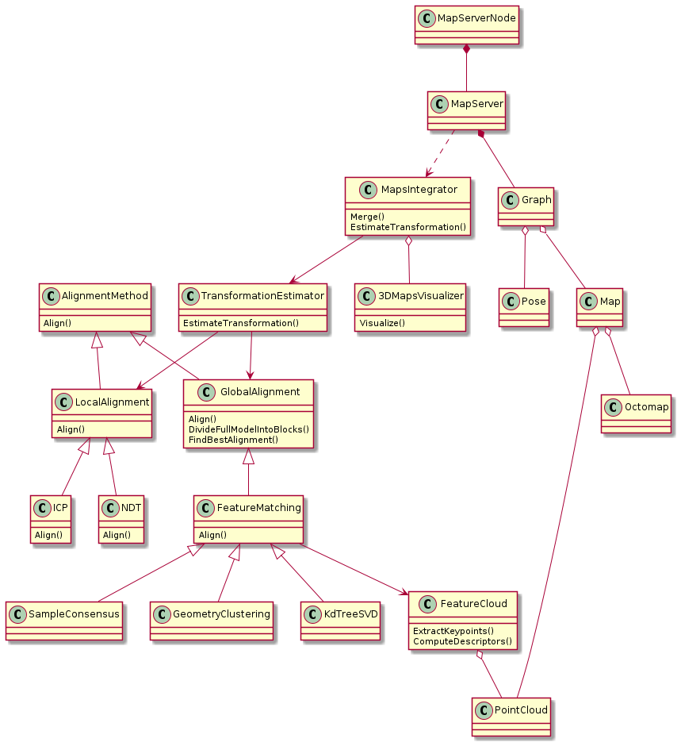

# 3d_map_server

The package contains the 3D map server.
Currently, it's based on the ROS1 but migration to the ROS2 is planned.

The main purpose of the package is to provide a 3D maps merging and maps storage tools.



Additional documentation is available in the following [publication](https://ieeexplore.ieee.org/document/9528427).
```
@inproceedings{drwiega21,
  author = {Michał Drwięga},
  title = {Incremental 3D Maps Server based on Feature Matching for Multi-robot Systems},
  journal = {25th International Conference on Methods and Models in Automation and Robotics (MMAR)},
  publisher = {IEEE},
  year = 2021,
  doi = {10.1109/MMAR49549.2021.9528427},
}
```

## Build

- Clone repository to the ROS workspace (e.g. ros_ws/src)
  `git clone https://gitlab.com/mdrwiega/3d_map_server.git`
- Compile the projects
  `catkin_make`

## Run maps merging tool with ROS

`roslaunch 3d_map_server merge_maps.launch map1:=/home/mdrwiega/ros_ws/src/3d_map_server/octomaps_dataset/fr_079_t1/scene.ot map2:=/home/mdrwiega/ros_ws/src/3d_map_server/octomaps_dataset/fr_079_t1/model.ot`

## Tests

- Compile tests

`catkin_make tests`

- Compile and run all tests

`catkin_make run_tests 3d_map_server`

- Run merge octomaps test - fr079

`~/ros_ws/devel/lib/3d_map_server/3d_map_server_test --gtest_filter=MapsIntegratorTest.Test_fr`

- Run merge octomaps test - pwr d20

`~/ros_ws/devel/lib/3d_map_server/3d_map_server_test --gtest_filter=MapsIntegratorTest.Test_pwr_d20_m4_t2`

### Integration tests

`rostest 3d_map_server octomaps_integrator.test --text`

## Design



## For developers

### Debugging

- In CMakeLists.txt change `CMAKE_BUILD_TYPE` from `RELEASE` to `RELWITHDEBINFO`.

- Then to run specific test
  `gdb --args ~/ros_ws/devel/lib/3d_map_server/3d_map_server_test --gtest_filter=MapsIntegratorTest.Test_pwr_d20_m1`

- In gdb:
  - `run`
  - `bt`

- Add to maps_integrator node
<!--     launch-prefix = "valgrind --leak-check=full" -->
          <!-- launch-prefix="gdb -ex run --args" -->

## References

- Used datasets are from http://ais.informatik.uni-freiburg.de/projects/datasets/octomap/